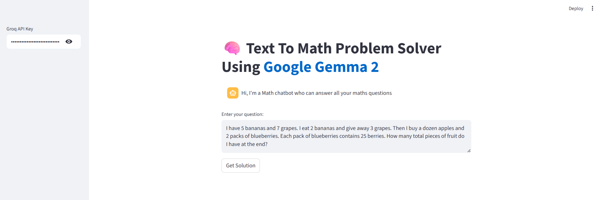
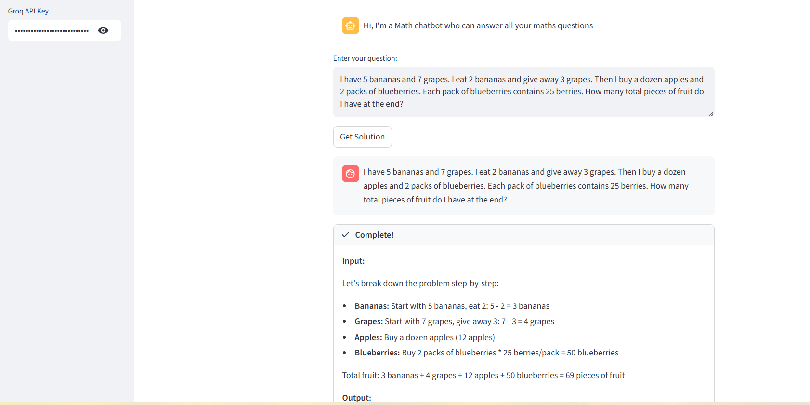

<div align="center">
  <strong></strong>

  # Text to Math Problem Solver and Data Search Assistant

  _By **BINATI AInalytics**_
</div>


A Streamlit-based intelligent assistant that combines mathematical problem-solving capabilities with data search functionality, powered by Google's Gemma 2 model via Groq API.

# Demo




## 🌟 Features

- **Mathematical Problem Solving**: Handles complex math problems with step-by-step reasoning
- **Wikipedia Integration**: Searches and retrieves information from Wikipedia for context
- **Logical Reasoning**: Provides detailed explanations with bullet-point breakdowns
- **Interactive Chat Interface**: User-friendly conversational interface
- **Real-time Processing**: Live response generation with visual feedback

## 🛠️ Technology Stack

- **Frontend**: Streamlit
- **LLM**: Google Gemma 2 (9B parameters) via Groq API
- **Framework**: LangChain for agent orchestration
- **Tools Integration**:
  - Wikipedia API for information retrieval
  - Built-in calculator for mathematical computations
  - Custom reasoning chain for logical problem-solving

## 📋 Prerequisites

- Python 3.8 or higher
- Groq API key (get one from [Groq Console](https://console.groq.com/))

## 🚀 Installation

1. **Clone the repository**
   ```bash
   git clone https://github.com/CyprianFusi/math-problem-solver.git
   cd math-problem-solver
   ```

2. **Install required packages**
   ```bash
   pip install -r requirements.txt
   ```

3. **Run the application**
   ```bash
   streamlit run app.py
   ```

## 🔧 Configuration

1. Launch the application
2. Enter your Groq API key in the sidebar
3. Start asking mathematical questions or requesting data searches

## 💡 Usage Examples

### Mathematical Problems
```
Question: "I have 5 bananas and 7 grapes. I eat 2 bananas and give away 3 grapes. Then I buy a dozen apples and 2 packs of blueberries. Each pack of blueberries contains 25 berries. How many total pieces of fruit do I have at the end?"
```

### Data Search Queries
```
Question: "What is the population of Tokyo and how does it compare to other major cities?"
```

### Logical Reasoning
```
Question: "If a train travels at 60 mph for 2 hours, then 80 mph for 1.5 hours, what's the average speed for the entire journey?"
```

## 🏗️ Architecture

The application uses a multi-agent architecture with three specialized tools:

1. **Wikipedia Tool**: Searches Wikipedia for factual information
2. **Calculator Tool**: Performs mathematical calculations using LangChain's LLMMathChain
3. **Reasoning Tool**: Provides logical step-by-step problem-solving

These tools are orchestrated by a ZERO_SHOT_REACT_DESCRIPTION agent that determines which tool to use based on the user's query.

## 🎯 Key Components

- **Agent Initialization**: Sets up the multi-tool agent with Wikipedia, calculator, and reasoning capabilities
- **Session Management**: Maintains conversation history using Streamlit's session state
- **Real-time Callbacks**: Provides live feedback during response generation
- **Error Handling**: Robust parsing error management

## 🔒 Security Notes

- API keys are handled securely through Streamlit's sidebar input
- No API keys are stored permanently in the application
- Users must provide their own Groq API credentials

## 🤝 Contributing

1. Fork the repository
2. Create a feature branch (`git checkout -b feature/amazing-feature`)
3. Commit your changes (`git commit -m 'Add some amazing feature'`)
4. Push to the branch (`git push origin feature/amazing-feature`)
5. Open a Pull Request

## 📝 License

This project is open source and available under the [MIT License](LICENSE).

## 🐛 Troubleshooting

**Common Issues:**

1. **API Key Error**: Ensure you have a valid Groq API key
2. **Package Installation**: Make sure all dependencies are installed correctly
3. **Port Issues**: If default port is busy, Streamlit will suggest an alternative

**Error Messages:**
- "Please add your Groq API key to continue" → Enter your API key in the sidebar
- Package import errors → Run `pip install -r requirements.txt`

## 📞 Support

If you encounter any issues or have questions, please open an issue in the GitHub repository.

## 🎉 Acknowledgments

- Google for the Gemma 2 model
- Groq for providing fast inference API
- LangChain team for the excellent framework
- Streamlit for the intuitive web app framework